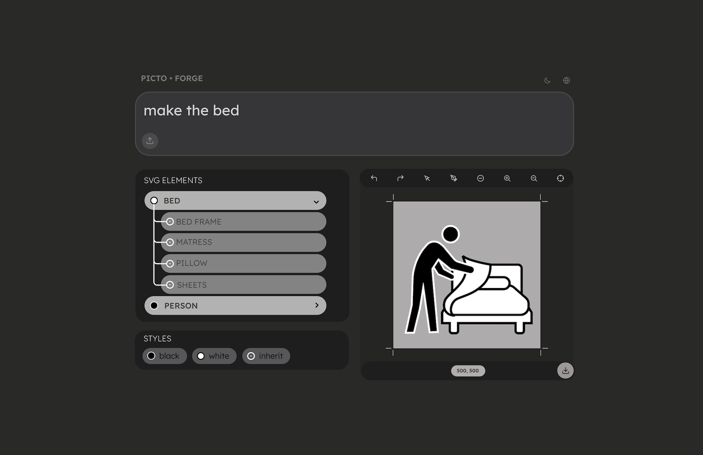

# PictoForge - Editor SVG Semántico

**PictoForge** es un editor de gráficos vectoriales SVG profesional y semántico, diseñado específicamente para trabajar con modelos de lenguaje generativo (LLMs). Proporciona una interfaz visual intuitiva con capacidades de etiquetado semántico, manipulación visual de vectores, y una arquitectura round-trip que permite la edición simultánea mediante interfaz gráfica y código.

La aplicación está optimizada para el flujo de trabajo con IA, permitiendo la generación, edición y refinamiento de gráficos vectoriales con retroalimentación humana estructurada, ideal para fine-tuning de modelos generativos.



## Diagnóstico del Proyecto (Estado Actual)

### Estado General
- **Versión**: 0.0.1
- **Estado del Código**: ✅ Limpio (sin errores de compilación)
- **Diagnósticos**: ⚠️ Solo advertencias de linting en archivos Markdown
- **Package Manager**: pnpm@10.4.1
- **Framework**: React 19.1.0 + Vite 6.3.5
- **Node.js**: Requiere 18+

### Dependencias Principales
```json
{
  "react": "^19.1.0",
  "react-dom": "^19.1.0",
  "vite": "^6.3.5",
  "tailwindcss": "^4.1.7",
  "@radix-ui/*": "Múltiples componentes UI",
  "lucide-react": "^0.510.0",
  "framer-motion": "^12.15.0"
}
```

### Testing
- **Framework**: Vitest 3.2.4
- **Testing Library**: @testing-library/react 16.3.0
- **Cobertura**: Configurada pero en desarrollo
- **Tests Existentes**:
  - OK `useSVGParser.test.js` - Tests de parseo de SVG
  - OK `useHistory.test.js` - Tests de undo/redo

**Scripts disponibles:**
```bash
pnpm test          # Ejecutar tests en modo watch
pnpm test:run      # Ejecutar tests una vez
pnpm test:ui       # UI interactiva de tests
pnpm test:coverage # Reporte de cobertura
```

### Funcionalidades Implementadas

#### Completamente Funcional
- [x] Carga de archivos SVG (drag & drop y botón)
- [x] Parseo y visualización de jerarquía SVG
- [x] Selección bidireccional (round-trip) entre jerarquía y canvas
- [x] Panel de estilos CSS con aplicación/remoción dinámica
- [x] Zoom y pan en el canvas
- [x] Tema claro/oscuro
- [x] Internacionalización (ES/EN)
- [x] Vista de código editable con numeración de líneas
- [x] Exportación de SVG
- [x] Sistema de historial (undo/redo)
- [x] Métricas de rendimiento

#### 🚧 Parcialmente Implementado
- [ ] **Herramienta Select** (Flecha negra):
  - [x] Selección de elementos
  - [x] BoundingBox con handles de resize
  - [x] Rotación de elementos
  - [-] Movimiento (implementado pero necesita refinamiento)
  - [-] Escalado (implementado pero necesita refinamiento)

- [ ] **Herramienta Node** (Flecha blanca):
  - [x] Visualización de nodos en paths
  - [x] Detección de nodos
  - [-] Edición de nodos (estructura presente, lógica en desarrollo)
  - [-] Manipulación de handles de Bézier (estructura presente)

- [ ] **Herramienta Pen** (Pluma):
  - [x] Selección de paths
  - [ ] Agregar nodos (estructura preparada)
  - [ ] Eliminar nodos (estructura preparada)
  - [ ] Cambiar tipo de nodos (smooth/corner/bezier)

#### Pendiente de Implementación
- [ ] Duplicación de elementos (función preparada en App.jsx:189)
- [ ] Eliminación de elementos (función preparada en App.jsx:197)
- [ ] Guardar con puntuación para fine-tuning
- [ ] Integración con modelos de lenguaje (API)
- [ ] Generación automática de SVG desde texto
- [ ] Templates y bibliotecas de elementos
- [ ] Exportación en múltiples formatos (PNG, PDF)

### Estructura de Archivos

```
src/
├── App.jsx                          # [202 líneas] Componente principal
├── components/
│   ├── SVGViewer.jsx               # [569 líneas] Visor principal con herramientas
│   ├── SVGHierarchy.jsx            # [135 líneas] Árbol de elementos
│   ├── TextInput.jsx               # Input superior
│   ├── StylePanel.jsx              # Panel de estilos CSS
│   ├── CodeView.jsx                # Vista de código editable
│   ├── BoundingBox.jsx             # Caja de transformación
│   ├── NodeEditor.jsx              # Editor de nodos (en desarrollo)
│   ├── PerformanceMetrics.jsx      # Métricas de rendimiento
│   ├── CustomIcons.jsx             # Iconos personalizados
│   ├── LanguageSelector.jsx        # Selector de idioma
│   └── FileLoadDemo.jsx            # Demo de carga
├── hooks/
│   ├── useSVGParser.js             # Hook de parseo de SVG
│   ├── useHistory.js               # Hook de undo/redo
│   ├── usePerformance.js           # Hook de optimización
│   └── useI18n.jsx                 # Hook de internacionalización
├── utils/
│   └── svgManipulation.js          # Utilidades de manipulación SVG
└── tests/
    ├── setup.js
    └── hooks/__tests__/
        ├── useSVGParser.test.js
        └── useHistory.test.js
```

### Issues Conocidos

1. **Manipulación de Transformaciones SVG** (src/components/SVGViewer.jsx:467-511)
   - Las transformaciones de resize y move funcionan pero pueden acumularse incorrectamente
   - Necesita mejor manejo de la matriz de transformación acumulada

2. **Edición de Nodos** (src/components/NodeEditor.jsx)
   - Estructura preparada pero lógica incompleta
   - Falta implementación de arrastre de nodos
   - Falta implementación de handles de control de Bézier

3. **Herramienta Pluma** (src/components/SVGViewer.jsx:153-162)
   - Preparada pero sin funcionalidad real
   - TODO comentado para agregar/eliminar nodos

4. **Duplicación/Eliminación** (src/App.jsx:189-200)
   - Funciones preparadas pero sin implementación
   - Solo registran console.log

### Próximos Pasos Recomendados

#### Alta Prioridad
1. Completar herramienta de edición de nodos (Node tool)
2. Implementar duplicación y eliminación de elementos
3. Mejorar sistema de transformaciones (acumulación de transforms)
4. Completar herramienta Pen para agregar/eliminar nodos

#### Media Prioridad
5. Implementar sistema de guardado con puntuación
6. Agregar más tests unitarios (cobertura actual baja)
7. Optimizar rendimiento para SVGs muy grandes
8. Mejorar validación de SVG en carga

#### Baja Prioridad
9. Integración con API de modelos de lenguaje
10. Exportación a PNG/PDF
11. Sistema de templates
12. Atajos de teclado

### Notas para Desarrollo con IA

**Nombres importantes para referencia:**
- Componente principal: `AppContent` en `src/App.jsx`
- Canvas principal: `SVGViewer` en `src/components/SVGViewer.jsx`
- Refs importantes: `svgRef`, `containerRef`, `overlayRef`
- Estados clave: `selectedElement`, `tool`, `zoom`, `pan`
- Hooks personalizados: `useSVGParser`, `useHistory`, `usePerformance`

**Arquitectura de coordenadas:**
- SVG usa su propio sistema de coordenadas (viewBox)
- Canvas aplica zoom y pan con CSS transform
- Overlay está en coordenadas de pantalla (sin transform)
- Ver `docs/coordinate-transformation.md` para detalles completos

## Mapa de la Interfaz (ASCII DivMap)

Esta es la estructura completa de la interfaz de PictoForge con todos los nombres de componentes:

```
┌─────────────────────────────────────────────────────────────────────────────────┐
│ HEADER [<header>]                                                               │
│ ┌─────────────────────────────────────────┬─────────────────────────────────┐   │
│ │ App Title + Subtitle                    │ LanguageSelector + ThemeToggle  │   │
│ │ "PictoForge" │ "Editor SVG Semántico"  │ [Button:   Sun/Moon]             │   │
│ └─────────────────────────────────────────┴─────────────────────────────────┘   │
└─────────────────────────────────────────────────────────────────────────────────┘

┌─────────────────────────────────────────────────────────────────────────────────┐
│ TEXTINPUT [TextInput Component]                                                 │
│ ┌───────────────────────────────────────────────────────────────────────────┐   │
│ │ Text Input Area + File Upload (Drag & Drop)                               │   │
│ │ [Upload Button] [placeholder: currentText]                                │   │
│ └───────────────────────────────────────────────────────────────────────────┘   │
└─────────────────────────────────────────────────────────────────────────────────┘

┌─────────────────────────────────────────────────────────────────────────────────┐
│ FILELOADDEMO [FileLoadDemo Component] - visible when !svgData                   │
│ Example file loader demonstration                                               │
└─────────────────────────────────────────────────────────────────────────────────┘

┌─────────────────────────────────────────────────────────────────────────────────┐
│ MAIN LAYOUT [<div className="flex-1 flex">] - Two Panel System                  │
│                                                                                 │
│ ┌────────────────────────────────────┬───────────────────────────────────────┐  │
│ │ LEFT PANEL (w-1/2)                 │ RIGHT PANEL (w-1/2)                   │  │
│ │                                    │                                       │  │
│ │ ┌────────────────────────────────┐ │ ┌────────────────────────────────────┐│  │
│ │ │ SVGHIERARCHY                   │ │ │ SVGVIEWER or CODEVIEW              ││  │
│ │ │ [SVGHierarchy Component]       │ │ │ (Toggle: showCodeView)             ││  │
│ │ │                                │ │ │                                    ││  │
│ │ │ Header: "SVG Elements"         │ │ │ ┌─────────────────────────────-───┐││  │
│ │ │                                │ │ │ │ TOOLBAR                         │││  │
│ │ │ Tree Structure:                │ │ │ │ ┌──────────┬─────────────────┐  │││  │
│ │ │ - [ChevronRight/Down] Toggle   │ │ │ │ │ Tools    │ Actions         │  │││  │
│ │ │ - [Icon] Element Type          │ │ │ │ │ ────────  ───────────────  │  │││  │
│ │ │ - [ID] Element Name            │ │ │ │ │ select   │ undo/redo       │  │││  │
│ │ │ - [.class] CSS Class           │ │ │ │ │ node     │ zoom in/out     │  │││  │
│ │ │ - (N) Children count           │ │ │ │ │ pen      │ reset view      │  │││  │
│ │ │                                │ │ │ │ │          │ export          │  │││  │
│ │ │ Elements:                      │ │ │ │ │          │ metrics         │  │││  │
│ │ │ • selectedElement (highlight)  │ │ │ │ └──────────┴─────────────────┘  │││  │
│ │ │ • expandedElements (Set)       │ │ │ └────────────────────────────────-┘││  │
│ │ │ • onClick: onElementSelect     │ │ │                                    ││  │
│ │ │                                │ │ │ ┌────────────────────────────────┐ ││  │
│ │ └────────────────────────────────┘ │ │ │ CANVAS AREA                    │ ││  │
│ │                                    │ │ │ [containerRef]                 │ ││  │
│ │ ┌────────────────────────────────┐ │ │ │                                │ ││  │
│ │ │ STYLEPANEL                     │ │ │ │ SVG Content [svgRef]           │ ││  │
│ │ │ [StylePanel Component]         │ │ │ │ • zoom + pan applied           │ ││  │
│ │ │                                │ │ │ │ • dangerouslySetInnerHTML      │ ││  │
│ │ │ Header: "Estilos CSS"          │ │ │ │ • onClick: handleElementClick  │ ││  │
│ │ │                                │ │ │ │                                │ ││  │
│ │ │ Styles List:                   │ │ │ │ Overlay [overlayRef, <svg>]    │ ││  │
│ │ │ • Available CSS classes        │ │ │ │ • pointer-events-none          │ ││  │
│ │ │ • Preview properties           │ │ │ │                                │ ││  │
│ │ │ • Apply/Remove buttons         │ │ │ │ ┌────────────────────────────┐ │ ││  │
│ │ │ • onStyleChange callback       │ │ │ │ │ BOUNDINGBOX                │ │ ││  │
│ │ │                                │ │ │ │ │ [BoundingBox Component]    │ │ ││  │
│ │ │ For selectedElement:           │ │ │ │ │                            │ │ ││  │
│ │ │ • fill, stroke properties      │ │ │ │ │ • 8 resize handles         │ │ ││  │
│ │ │ • stroke-width, stroke-join    │ │ │ │ │ • rotation handle          │ │ ││  │
│ │ └────────────────────────────────┘ │ │ │ │ • visible: tool=='select'  │ │ ││  │
│ │                                    │ │ │ │ • onResize, onMove, onRot  │ │ ││  │
│ └────────────────────────────────────┘ │ │ └────────────────────────────┘ │ ││  │
│                                        │ │                                │ ││  │
│                                        │ │ ┌────────────────────────────┐ │ ││  │
│                                        │ │ │ NODEEDITOR                 │ │ ││  │
│                                        │ │ │ [NodeEditor Component]     │ │ ││  │
│                                        │ │ │                            │ │ ││  │
│                                        │ │ │ • node circles (paths)     │ │ ││  │
│                                        │ │ │ • control handles (bezier) │ │ ││  │
│                                        │ │ │ • visible: tool=='node'    │ │ ││  │
│                                        │ │ │   or tool=='pen'           │ │ ││  │
│                                        │ │ │ • onNodeChange, onNodeAdd  │ │ ││  │
│                                        │ │ │   onNodeRemove             │ │ ││  │
│                                        │ │ └────────────────────────────┘ │ ││  │
│                                        │ │                                │ ││  │
│                                        │ │ ┌────────────────────────────┐ │ ││  │
│                                        │ │ │ PERFORMANCEMETRICS         │ │ ││  │
│                                        │ │ │ [PerformanceMetrics Comp]  │ │ ││  │
│                                        │ │ │ • visible: showMetrics     │ │ ││  │
│                                        │ │ │ • complexity, metrics      │ │ ││  │
│                                        │ │ └────────────────────────────┘ │ ││  │
│                                        │ └────────────────────────────────┘ ││  │
│                                        │                                    ││  │
│                                        │ ┌────────────────────────────────┐ ││  │
│                                        │ │ CODEVIEW (alternate view)      │ ││  │
│                                        │ │ [CodeView Component]           │ ││  │
│                                        │ │                                │ ││  │
│                                        │ │ • Line numbers                 │ ││  │
│                                        │ │ • Syntax highlighting          │ ││  │
│                                        │ │ • Editable SVG code            │ ││  │
│                                        │ │ • onSVGUpdate callback         │ ││  │
│                                        │ │ • selectedElement highlight    │ ││  │
│                                        │ └────────────────────────────────┘ ││  │
│                                        └────────────────────────────────────┘┘  │
└─────────────────────────────────────────────────────────────────────────────────┘

┌─────────────────────────────────────────────────────────────────────────────────┐
│ FOOTER [<footer>]                                                               │
│ ┌─────────────────────────────────────────┬─────────────────────────────────┐   │
│ │ Stats: "N estilos" │ "Elemento: id"     │ "Versión 0.0.1"                 │   │
│ └─────────────────────────────────────────┴─────────────────────────────────┘   │
└─────────────────────────────────────────────────────────────────────────────────┘
```

### Componentes Principales por Nombre

| Componente            | Archivo                              | Función Principal                          |
|-----------------------|--------------------------------------|--------------------------------------------|
| `AppContent`          | `src/App.jsx`                        | Contenedor principal de la aplicación      |
| `I18nProvider`        | `src/hooks/useI18n.jsx`              | Proveedor de internacionalización          |
| `LanguageSelector`    | `src/components/LanguageSelector.jsx`| Selector de idioma (ES/EN)                 |
| `TextInput`           | `src/components/TextInput.jsx`       | Input de texto + carga de archivos         |
| `FileLoadDemo`        | `src/components/FileLoadDemo.jsx`    | Demo de carga de ejemplos                  |
| `SVGHierarchy`        | `src/components/SVGHierarchy.jsx`    | Árbol jerárquico de elementos SVG          |
| `StylePanel`          | `src/components/StylePanel.jsx`      | Panel de gestión de estilos CSS            |
| `SVGViewer`           | `src/components/SVGViewer.jsx`       | Visor principal con herramientas           |
| `CodeView`            | `src/components/CodeView.jsx`        | Vista de código editable                   |
| `BoundingBox`         | `src/components/BoundingBox.jsx`     | Caja de transformación con handles         |
| `NodeEditor`          | `src/components/NodeEditor.jsx`      | Editor de nodos de paths                   |
| `PerformanceMetrics`  | `src/components/PerformanceMetrics.jsx` | Métricas de rendimiento                  |
| `CustomIcons`         | `src/components/CustomIcons.jsx`     | Iconos personalizados (SelectArrow, Pen, etc.) |
| `useSVGParser`        | `src/hooks/useSVGParser.js`          | Hook de parseo y gestión de SVG            |
| `useHistory`          | `src/hooks/useHistory.js`            | Hook de undo/redo                          |
| `usePerformance`      | `src/hooks/usePerformance.js`        | Hook de optimización de rendimiento        |

### Estados Principales (State Management)

**En App.jsx:**
- `darkMode` - Tema claro/oscuro
- `currentText` - Texto en input superior
- `expandedElements` - Set de elementos expandidos en jerarquía
- `showCodeView` - Toggle entre SVGViewer y CodeView
- `selectedElement` - Elemento actualmente seleccionado

**En SVGViewer.jsx:**
- `tool` - Herramienta activa: 'select' │ 'node' │ 'pen'
- `zoom` - Nivel de zoom del canvas
- `pan` - {x, y} para paneo del canvas
- `selectedSVGElement` - Referencia DOM del elemento seleccionado
- `showBoundingBox` - Visibilidad del bounding box
- `showMetrics` - Visibilidad de métricas de performance

**En useSVGParser.js:**
- `svgData` - Estructura parseada del SVG {root, styles, elements}
- `svgContent` - Contenido string del SVG
- `selectedElement` - Elemento seleccionado en la jerarquía

## Características Principales

### Interfaz de Tres Paneles
- **Panel Superior**: Entrada de texto con carga de archivos SVG por drag & drop
- **Panel Izquierdo**: Jerarquía de elementos SVG con iconos apropiados y panel de estilos CSS
- **Panel Central**: Visor SVG interactivo con herramientas de edición y vista de código alternativa

### Selección Bidireccional ("Round Trip Interface")
- Seleccionar elementos en la jerarquía los resalta en el visor
- Hacer clic en elementos del SVG los selecciona en la jerarquía
- Auto-expansión de la ruta hacia elementos seleccionados

### Herramientas de Edición Visual
- **Flecha negra (Select)**: Selección, movimiento, escalado y rotación de entidades completas con bounding box
- **Flecha blanca (Node)**: Edición de nodos individuales en paths (seleccionar, mover, ajustar puntos de control)
- **Pluma (Pen)**: Herramienta para agregar/eliminar nodos y cambiar tipos de curva
- **Sistema de transformación de coordenadas**: Conversión precisa entre espacio de pantalla y SVG (con soporte para zoom, pan y viewBox)
- Zoom in/out, reseteo de vista, descarga de SVG, deshacer/rehacer

### Sistema de Estilos
- Visualización de clases CSS definidas en el SVG
- Aplicación/remoción dinámica de estilos a elementos
- Vista previa de propiedades CSS (fill, stroke, stroke-linejoin, etc.)

### Herramientas Avanzadas
- Guardar, deshacer/rehacer (preparado)
- Copiar, duplicar y eliminar elementos (preparado)
- Vista de código SVG editable con numeración de líneas
- Estadísticas en tiempo real (número de elementos y estilos)

### Características Adicionales
- Tema claro/oscuro
- Interfaz responsive y profesional
- Animaciones suaves y micro-interacciones
- Manejo de errores y validación de archivos SVG

## Instalación y Uso

### Prerrequisitos
- Node.js 18+ 
- npm o pnpm

### Instalación
```bash
# Clonar el repositorio
git clone https://github.com/hspencer/pictoforge.git
cd pictoforge

# Instalar dependencias
npm install
# o
pnpm install
```

### Desarrollo
```bash
# Iniciar servidor de desarrollo
npm run dev
# o
pnpm run dev

# La aplicación estará disponible en http://localhost:5173
```

### Construcción para Producción
```bash
# Construir para producción
npm run build
# o
pnpm run build

# Los archivos se generarán en la carpeta 'dist/'
```

### Vista Previa de Producción
```bash
# Previsualizar el build de producción localmente
npm run preview
# o
pnpm run preview

# La aplicación estará disponible en http://localhost:4173
```

## Deployment (Despliegue)

PictoForge es una aplicación estática (SPA) que puede desplegarse en cualquier servicio de hosting estático.

### Especificaciones de Deployment

#### Requisitos del Servidor
- **Tipo**: Static site hosting
- **Node.js**: 18+ (solo para build, no necesario en producción)
- **Directorio de salida**: `dist/`
- **Comando de build**: `npm run build` o `pnpm run build`
- **Archivos estáticos**: HTML, CSS, JS, SVG
- **SPA**: Requiere configuración de fallback a `index.html` para rutas

#### Variables de Entorno
No se requieren variables de entorno para el funcionamiento básico. La aplicación es completamente client-side.

### Opciones de Deployment

#### 1. Vercel (Recomendado)
```bash
# Instalar Vercel CLI
npm i -g vercel

# Deploy
vercel

# Configuración automática detectada por vercel.json o package.json
```

**Configuración recomendada** (`vercel.json`):
```json
{
  "buildCommand": "npm run build",
  "outputDirectory": "dist",
  "framework": "vite",
  "rewrites": [
    { "source": "/(.*)", "destination": "/index.html" }
  ]
}
```

#### 2. Netlify
```bash
# Instalar Netlify CLI
npm i -g netlify-cli

# Deploy
netlify deploy --prod
```

**Configuración recomendada** (`netlify.toml`):
```toml
[build]
  command = "npm run build"
  publish = "dist"

[[redirects]]
  from = "/*"
  to = "/index.html"
  status = 200
```

#### 3. GitHub Pages
```bash
# Agregar al package.json:
# "homepage": "https://<usuario>.github.io/<repo>"

# Instalar gh-pages
npm install --save-dev gh-pages

# Agregar script de deploy
# "deploy": "npm run build && gh-pages -d dist"

# Deploy
npm run deploy
```

**Configuración recomendada** (`vite.config.js`):
```javascript
export default defineConfig({
  base: process.env.NODE_ENV === 'production' ? '/<repo-name>/' : '/',
  // ... resto de la configuración
})
```

#### 4. AWS S3 + CloudFront
```bash
# Construir
npm run build

# Subir a S3
aws s3 sync dist/ s3://tu-bucket-name --delete

# Invalidar caché de CloudFront
aws cloudfront create-invalidation --distribution-id TU_DISTRIBUTION_ID --paths "/*"
```

**Configuración S3 Bucket**:
- Static website hosting habilitado
- Index document: `index.html`
- Error document: `index.html` (para SPA routing)

#### 5. Docker (Para deployment en servidor propio)

**Dockerfile**:
```dockerfile
# Build stage
FROM node:18-alpine AS builder
WORKDIR /app
COPY package*.json ./
RUN npm ci
COPY . .
RUN npm run build

# Production stage
FROM nginx:alpine
COPY --from=builder /app/dist /usr/share/nginx/html
COPY nginx.conf /etc/nginx/conf.d/default.conf
EXPOSE 80
CMD ["nginx", "-g", "daemon off;"]
```

**nginx.conf**:
```nginx
server {
    listen 80;
    server_name localhost;
    root /usr/share/nginx/html;
    index index.html;

    location / {
        try_files $uri $uri/ /index.html;
    }

    # Caché para assets estáticos
    location ~* \.(js│css│png│jpg│jpeg│gif│svg│ico│woff│woff2│ttf│eot)$ {
        expires 1y;
        add_header Cache-Control "public, immutable";
    }
}
```

**Comandos Docker**:
```bash
# Build
docker build -t pictoforge .

# Run
docker run -d -p 80:80 pictoforge
```

### Optimizaciones de Producción

#### Build Optimization
El proyecto ya incluye optimizaciones de Vite:
- Code splitting automático
- Tree shaking
- Minificación de JS/CSS
- Compresión de assets

#### Performance Checklist
- ✅ Lazy loading de componentes pesados
- ✅ Optimización de assets SVG
- ✅ Caché de navegador configurado
- ✅ Compresión gzip/brotli (configurar en servidor)
- ✅ CDN para distribución global (recomendado)

#### Monitoreo
Se recomienda configurar:
- **Analytics**: Google Analytics, Plausible, etc.
- **Error tracking**: Sentry, LogRocket, etc.
- **Performance monitoring**: Web Vitals, Lighthouse CI

### Consideraciones de Seguridad

#### Headers HTTP Recomendados
```nginx
# Agregar en configuración del servidor
add_header X-Frame-Options "SAMEORIGIN" always;
add_header X-Content-Type-Options "nosniff" always;
add_header X-XSS-Protection "1; mode=block" always;
add_header Referrer-Policy "strict-origin-when-cross-origin" always;
add_header Content-Security-Policy "default-src 'self'; script-src 'self' 'unsafe-inline'; style-src 'self' 'unsafe-inline';" always;
```

#### HTTPS
- **Obligatorio** para producción
- Let's Encrypt gratuito para certificados SSL
- La mayoría de plataformas (Vercel, Netlify) incluyen HTTPS automático

### Troubleshooting Deployment

#### Problema: Rutas 404 en reload
**Solución**: Configurar servidor para servir `index.html` en todas las rutas (ver configuraciones arriba)

#### Problema: Assets no cargan
**Solución**: Verificar `base` en `vite.config.js` coincida con el path de deployment

#### Problema: Build falla por memoria
**Solución**: Aumentar memoria de Node.js
```bash
NODE_OPTIONS=--max_old_space_size=4096 npm run build
```

## Arquitectura del Proyecto

```
pictoforge/
├── public/                 # Archivos estáticos
├── src/
│   ├── assets/            # Recursos (SVGs de ejemplo)
│   ├── components/        # Componentes React
│   │   ├── ui/           # Componentes de UI (shadcn/ui)
│   │   ├── AdvancedTools.jsx
│   │   ├── CodeView.jsx
│   │   ├── FileLoadDemo.jsx
│   │   ├── StylePanel.jsx
│   │   ├── SVGHierarchy.jsx
│   │   ├── SVGViewer.jsx
│   │   └── TextInput.jsx
│   ├── hooks/            # Hooks personalizados
│   │   └── useSVGParser.js
│   ├── lib/              # Utilidades
│   ├── App.jsx           # Componente principal
│   ├── App.css           # Estilos personalizados
│   ├── index.css         # Estilos globales
│   └── main.jsx          # Punto de entrada
├── components.json        # Configuración shadcn/ui
├── package.json
├── vite.config.js
└── README.md
```

## 🧩 Componentes Principales

### `useSVGParser` (Hook)
Hook personalizado que maneja:
- Parseo de contenido SVG
- Extracción de jerarquía de elementos
- Extracción de estilos CSS
- Búsqueda y navegación de elementos

### `SVGHierarchy`
Componente que muestra:
- Estructura jerárquica de elementos SVG
- Iconos apropiados para cada tipo de elemento
- Estado de expansión/colapso
- Selección visual de elementos

### `SVGViewer`
Componente principal de visualización:
- Renderizado del SVG
- Herramientas de navegación (zoom, pan)
- Selección interactiva de elementos
- Resaltado visual de elementos seleccionados

### `StylePanel`
Panel de gestión de estilos:
- Lista de clases CSS disponibles
- Aplicación/remoción de estilos
- Vista previa de propiedades CSS

### `CodeView`
Editor de código SVG:
- Sintaxis highlighting (básico)
- Numeración de líneas
- Edición en tiempo real
- Validación de SVG

## Tecnologías Utilizadas

- **React 18** - Framework principal
- **Vite** - Bundler y servidor de desarrollo
- **Tailwind CSS** - Framework de estilos
- **shadcn/ui** - Componentes de interfaz
- **Lucide Icons** - Iconografía
- **JavaScript** - Lenguaje principal

## Uso Básico

1. **Cargar un SVG**: 
   - Usa el botón de carga en el panel superior
   - Arrastra y suelta un archivo SVG
   - Usa los ejemplos incluidos

2. **Navegar la jerarquía**:
   - Expande/colapsa grupos en el panel izquierdo
   - Haz clic en elementos para seleccionarlos

3. **Editar estilos**:
   - Selecciona un elemento
   - Usa el panel de estilos para aplicar/remover clases CSS

4. **Ver código**:
   - Usa el botón "Ver código SVG" en la barra de herramientas
   - Edita el código directamente

## Funcionalidades Futuras (TODO)

### Sistema de "Guardado con Puntuación"
- Implementar sistema de versionado para fine-tuning de modelos
- Guardar estados intermedios con puntuaciones
- Historial de cambios con métricas

### Herramientas de Edición Avanzadas
- Implementar funcionalidad completa de la herramienta "pluma"
- Edición de formas y paths
- Transformaciones (rotar, escalar, mover)

### Integración con Modelos de Lenguaje
- API para conectar con modelos generativos
- Generación automática de SVG desde texto
- Sugerencias inteligentes de mejoras

### Funcionalidades Adicionales
- Deshacer/rehacer completo
- Duplicación y eliminación de elementos
- Exportación en múltiples formatos
- Plantillas y bibliotecas de elementos

## Problemas Conocidos

- La funcionalidad de deshacer/rehacer está preparada pero no completamente implementada
- La herramienta de edición "pluma" necesita desarrollo adicional
- La duplicación y eliminación de elementos requiere implementación completa

## Contribución

Este proyecto está diseñado para ser extensible. Las áreas principales para contribución incluyen:

1. **Herramientas de edición**: Implementar funcionalidades de edición visual
2. **Integración IA**: Conectar con modelos de lenguaje
3. **Exportación**: Añadir más formatos de exportación
4. **Performance**: Optimizar para SVGs grandes y complejos
